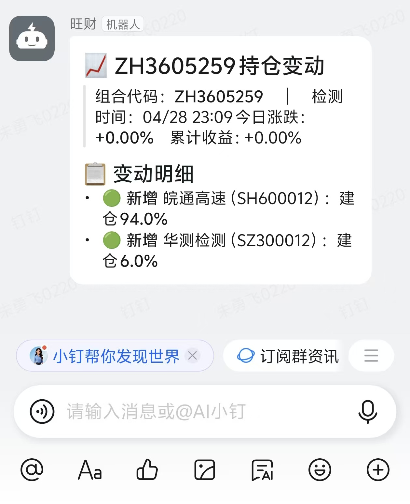

# 雪球组合监控 · 钉钉通知

> 定时监控雪球组合持仓变动，有变动时通过钉钉机器人推送通知。

**当前版本**：v2.0 | **更新时间**：2026-04-28

---

## 功能特性

- **自动轮询** — 内置定时循环，无需额外调度器
- **仓位变动检测** — 基于 `prev_weight → weight` 权重变化判断加仓/减仓
- **三接口级联降级** — 主接口 → v5备用 → history降级，自动切换保障稳定
- **钉钉 Markdown 通知** — 支持 @个人 或 @所有人
- **状态持久化** — 本地 JSON 文件保存持仓快照，重启不丢失
- **零第三方依赖** — 纯 `requests`，不依赖 pysnowball

---

## 快速开始

### 1. 安装依赖

```bash
pip install requests python-dotenv
```

### 2. 配置 .env

复制 `.env.example` 为 `.env`，填写以下必填项：

```env
XUEQIU_COOKIE=xq_a_token=你的token;u=你的uid
DINGTALK_WEBHOOK=https://oapi.dingtalk.com/robot/send?access_token=你的access_token
MONITORED_CUBES=ZH123456
```

### 3. 运行

```bash
python xueqiu_monitor.py
```

---

## 配置说明

### 必填配置

| 配置项 | 说明 |
|--------|------|
| `XUEQIU_COOKIE` | 雪球登录 Cookie，登录后从 F12 → Network 获取 |
| `DINGTALK_WEBHOOK` | 钉钉机器人 Webhook 地址 |
| `MONITORED_CUBES` | 要监控的组合代码，多个用逗号分隔 |

### 可选配置

| 配置项 | 默认值 | 说明 |
|--------|--------|------|
| `CHECK_INTERVAL` | 300 | 检查间隔（秒），5 分钟 |
| `WEIGHT_CHANGE_THRESHOLD` | 1.0 | 仓位变动阈值（%），超过才通知 |
| `AT_ALL` | false | 是否 @所有人 |
| `LOG_FILE` | xueqiu_monitor.log | 日志文件路径 |

---

## Token 获取

### 雪球 Cookie

1. 浏览器登录 [https://xueqiu.com](https://xueqiu.com)
2. 按 `F12` 打开开发者工具 → 切换到 **Network** 标签
3. 刷新页面，随便点一个请求
4. 在 **Request Headers** 中找到 `Cookie` 字段
5. 复制完整 Cookie 字符串，粘贴到配置中

> 注意：Cookie 有时效性，过期后需重新获取。

### 钉钉 Webhook

1. 打开钉钉群 → 群设置 → 智能群助手 → 添加机器人
2. 选择「自定义」机器人
3. 安全设置选「关键词」，填入 `雪球`
4. 复制 Webhook URL 到配置

---

## 通知效果

触发变动时，钉钉会收到如下 Markdown 消息：

```markdown
## 📈 组合名称 持仓变动
> 组合代码：ZH123456　｜　检测时间：04/28 23:30
> 今日涨跌：+1.25%　累计收益：+15.80%

### 📋 变动明细
- 📈 **加仓** 贵州茅台（SH600519）：25.0% → **28.5%**（+3.5%）  当前价 ¥1680.00
- 🔴 **卖出** 中国平安（SH601318）：清仓（原仓位 10.0%）
```

---

## 文件结构

```
xueqiu_monitor/
├── xueqiu_monitor.py    # 主脚本
├── .env.example         # 配置模板
├── .env                 # 实际配置（需手动创建）
├── requirements.txt     # Python 依赖
├── monitor_state.json   # 持仓快照（自动生成）
└── xueqiu_monitor.log   # 运行日志（自动生成）
```

---

## 常见问题

**Q: 报 403/401 错误？**  
A: Cookie 已失效或无效。请重新登录雪球获取新的 Cookie。

**Q: 报 404 错误？**  
A: 组合代码错误或组合不存在。请确认组合代码正确且为公开组合。

**Q: 持仓列表为空？**  
A: 可能是私密组合，或 Cookie 无权限访问该组合。

**Q: 通知没收到？**  
A: 检查钉钉群机器人关键词是否包含在消息中（关键词：雪球）。

**Q: 想同时监控多个组合？**  
A: 在 `MONITORED_CUBES` 中用逗号分隔即可：
```
MONITORED_CUBES=ZH123456,ZH654321,ZH111111
```

---

## API 接口说明

| 优先级 | 接口 | 说明 |
|--------|------|------|
| 1 | `/cubes/rebalancing/current.json` | 最新持仓（主接口） |
| 2 | `/v5/cube/rebalancing/current.json` | v5 备用（可能 404） |
| 3 | `/cubes/rebalancing/history.json` | 调仓历史（降级兜底） |

---

## 停止监控

```bash
# 按 Ctrl+C 正常停止
```

---

## License

MIT
